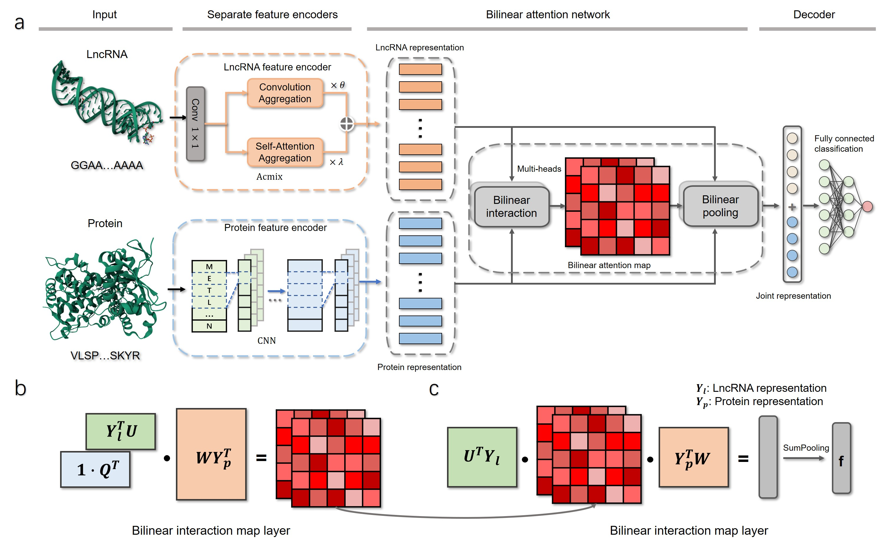

# LPIBAN: Interpretable bilinear attention network for lncRNA–protein prediction

This repository contains the official implementation of the paper:

> This repository contains the official implementation of the paper **"LPIBAN: Interpretable bilinear attention network for lncRNA–protein prediction"**.
> LPIBAN introduces a novel bilinear attention network that enhances cross-modal feature fusion between lncRNAs and proteins, significantly improving prediction performance.

---

## Framework and Dataset
<p align="center">
  
</p>
All datasets used in this work are publicly available and can be downloaded from the following link:  
👉 [Google Drive Dataset](https://drive.google.com/drive/folders/11j-UZmcGegzxNt5bpGVZDPRAjfQCsNcs?usp=sharing)  

After downloading, please place the dataset files into the `data_LPI/` directory.
---

## 📁 Directory Structure

```bash
LPIBAN/
├── code/                    # code of LPIBAN
├── output/                  # output of model
├── framework.png            # BiIN-LPI Framework
└── README.md                # You are here
```

---

## 📁 Environment Setup

This project was developed and tested under the following environment:

### 🔧 System & Runtime

- **Python**: 3.8.20  
- **CUDA**: 12.4  
- **PyTorch**: 1.12.1  
- **Torch Geometric**: 2.6.1  
- **DGL (Deep Graph Library)**: 0.9.1 (`dgl-cu113` for CUDA 11.3)

> ⚠️ **Note**: While the system has CUDA 12.4 installed, `dgl-cu113` is built for CUDA 11.3.  
> Ensure CUDA compatibility when changing PyTorch/DGL versions.

---

### 📦 Key Python Dependencies

```
torch>=1.7.1
dgl>=0.7.1
dgllife>=0.2.8
numpy>=1.20.2
scikit-learn>=0.24.2
pandas>=1.2.4
prettytable>=2.2.1
rdkit~=2021.03.2
yacs~=0.1.8
```


---

## 🧪 How to Run

To start training and evaluation, simply run:

```bash
python main.py --data LPI --split fold_5
```

Make sure the environment is set correctly.


